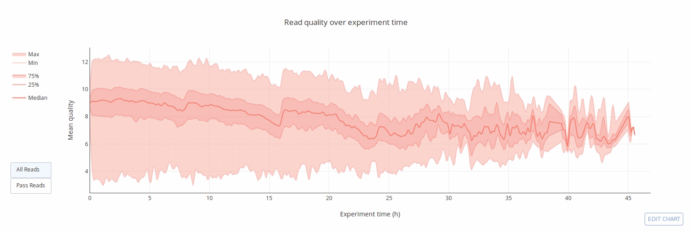

# pycoQC-2

[](http://joss.theoj.org/papers/ea8e08dc950622bdd5d16a65649954aa)
[](https://zenodo.org/badge/latestdoi/94531811)
[](https://github.com/a-slide/pycoQC/blob/master/LICENSE)
[](https://www.python.org/)
[](https://badge.fury.io/py/pycoQC)
[](https://pepy.tech/project/pycoqc)

---

**PycoQC computes metrics and generates interactive QC plots for Oxford Nanopore technologies sequencing data**

PycoQC relies on the *sequencing_summary.txt* file generated by Albacore and Guppy, but if needed it can also generates a summary file from basecalled fast5 files. The package supports 1D and 1D2 runs generated with Minion, Gridion and Promethion devices and basecalled with Albacore 1.2.1+ or Guppy 2.1.3+. PycoQC is written in pure Python3. **Python 2 is not supported**.

# Gallery

**Click on a picture to access an online interactive version editable with [plotly chart studio](https://plot.ly/online-chart-maker/)**

[](https://plot.ly/~aleg/16/)

[](https://plot.ly/~aleg/2/distribution-of-read-length/)

[](https://plot.ly/~aleg/66/distribution-of-read-quality-scores/)

[](https://plot.ly/~aleg/3/mean-read-quality-per-sequence-length/)

[](https://plot.ly/~aleg/4/output-per-channel-over-experiment-time/)

[](https://plot.ly/~aleg/5/output-over-experiment-time/)

[](https://plot.ly/~aleg/6/mean-read-quality-over-experiment-time/)

[](https://plot.ly/~aleg/28/read-length-over-experiment-time/)

[](https://plot.ly/~aleg/7/percentage-of-reads-per-barcode/)

# Installation

Ideally, before installation, create a clean **Python 3** virtual environment to deploy the package. **Python 2 is not supported**. For example you can use conda or virtualenvwrapper (see [tutorial](http://www.simononsoftware.com/virtualenv-tutorial-part-2/)).

## Dependencies

pycoQC relies on a few robustly maintained third party libraries listed below. The correct versions of the packages are installed together with the software when using pip.

* numpy>=1.13
* scipy>=1.1
* pandas>=0.23
* plotly>=3.4
* jinja2>=2.10
* h5py>=2.8.0
* tqdm>=4.23'

## Option 1: Direct installation with pip from pipy (recommended)

Install the package with pip3. Python dependencies are automatically installed.

`pip3 install pycoQC`

To update the package:

`pip3 install pycoQC --upgrade`

## Option 2: Clone the repository and install locally in develop mode

With this option, the package will be locally installed in “editable” or “develop” mode. This allows the package to be both installed and editable in project form. This is the recommended option if you wish to modify the code and/or participate to the development of the package (see [contribution guidelines](https://github.com/a-slide/pycoQC/blob/master/CONTRIBUTING.md)).

`git clone https://github.com/a-slide/pycoQC.git`

`cd pycoQC`

`chmod u+x setup.py`

`pip3 install -e ./`

# Usage

## Input files

PycoQC needs a text summary file generated by ONT Albacore or Guppy. For 1D run use the file named *sequencing_summary.txt* available the root of Albacore/Guppy output directory. For 1D2, use the *sequencing_1dsq_summary.txt* file that can be found in the 1dsq_analysis directory. The run type is automatically detected from the file.

PycoQC can read compressed sequencing_summary.txt files (‘gzip’, ‘bz2’, ‘zip’, ‘xz’) and instead of a single file it is also possible to pass a [UNIX style regex](https://docs.python.org/3.6/library/glob.html) to match multiple files.

PycoQC requires the following fields in the sequencing.summary file:

* 1D run => read_id, run_id, channel, start_time, sequence_length_template, mean_qscore_template
* 1D2 run => read_id, run_id, channel, start_time, sequence_length_2d, mean_qscore_2d

### Calibration strand reads

Depending on the run type and the version of Albacore/Guppy calibration reads informations might not be available. For example, these reads were not flagged in early versions of Albacore and are not flagged any more in Guppy. By default calibration reads are kept, but it is also possible to discard them using the option `filter_calibration`.

### Barcoded datasets

Barcodes information is only available in multiplexed runs. For Albacore, this is contained directly in the sequencing summary file and it is automatically fetched when available. For Guppy, barcodes identification is now done after basecalling with a separate program (`guppy_barcoder`) which generates a `barcoding_summary.txt` file. PycoQC can read this file and (`barcode_file` option) and merge the barcode information with the sequencing summary data.

### Generating a sequencing summary file from Fast5 files

In case you do not have access to a summary sequencing file, pycoQC comes with a simple yet efficient tool to generate such file from a directory containing basecalled fast5 files. Please see the Demo notebook below for more information on how to generate to file through the python API. At the moment multi-fast5 files generated by Guppy are not supported.

## Interactive usage in Jupyter Notebook

The Jupyter Notebook is a fantastic tool that can be used in many different ways, in particular to share you analyses in an interactive environment with other people.

One of the specificity of pycoQC is to have a rich python API meant to be used directly inside a Jupyter notebook. The pycoQC API for Jupyter is very flexible and allows you to explore your nanopore data interactively and in more depth than with the command line interface.

### Demo notebook

An online live usage notebook served by MyBinder is available to familiarize with the package API:

[](https://mybinder.org/v2/gh/a-slide/pycoQC/master?filepath=docs%2FpycoQC_usage.ipynb) (Can take a few minutes)

A static html version of the same notebook is also available if you experience any issue with the live version:

[](https://a-slide.github.io/pycoQC/pycoQC_usage.html)

### Running your own notebook locally

If you want to run pycoQC interactively in Jupyter you need to install Jupyter manually. If you installed pycoQC in a virtual environment then install Jupyter in the same virtual environment.

`pip3 install notebook`

Launch the notebook in a shell terminal

`jupyter notebook`

If it does not auto-start, open the following URL in you favorite web browser http://localhost:8888/tree

From Jupyter homepage you can navigate to the directory you want to work in and create a new Python3 Notebook.

Then, to analyse your data follow the instructions given in the example usage notebook above.

## Command line interface usage

On top of the jupyter interface, pycoQC also comes with a command line interface that can generate a beautiful HTML formatted report containing interactive D3.js plots.

### Basic pycoQC Usage

`pycoQC -f {path to summary_sequencing file} -o {path to output html report file}`

In addtion for guppy barcoded datasets you also have to provide a barcoding summary file

`pycoQC -f {path to summary_sequencing file} -b {path to barcoding_summary file} -o {path to output html report file}`


Example HTML reports generated by pycoQC from sample data are available below.

* [Albacore-1.2.1_basecall-1D-DNA](https://a-slide.github.io/pycoQC/data/output/Albacore-1.2.1_basecall-1D-DNA_pycoQC.html)
* [Albacore-1.2.3_basecall-1D-RNA](https://a-slide.github.io/pycoQC/data/output/Albacore-1.2.3_basecall-1D-RNA_pycoQC.html)
* [Albacore-1.7.0_basecall-1D-DNA](https://a-slide.github.io/pycoQC/data/output/Albacore-1.7.0_basecall-1D-DNA_pycoQC.html)
* [Albacore-2.1.10_basecall-1D-DNA](https://a-slide.github.io/pycoQC/data/output/Albacore-2.1.10_basecall-1D-DNA_pycoQC.html)
* [Albacore-2.1.10_basecall-1D-RNA](https://a-slide.github.io/pycoQC/data/output/Albacore-2.1.10_basecall-1D-RNA_pycoQC.html)
* [Albacore-2.3.1_basecall-1D-RNA](https://a-slide.github.io/pycoQC/data/output/Albacore-2.3.1_basecall-1D-RNA_pycoQC.html)
* [Guppy-2.1.3_basecall-1D-DNA](https://a-slide.github.io/pycoQC/data/output/Guppy-2.1.3_basecall-1D-DNA_pycoQC.html)
* [Guppy-2.1.3_basecall-1D-RNA](https://a-slide.github.io/pycoQC/data/output/Guppy-2.1.3_basecall-1D-RNA_pycoQC.html)

pycoQC help can be obtained by using `pycoQC --help`.

```
usage: pycoQC [--version] [--file FILE] [--barcode_file BARCODE_FILE]
              [--outfile OUTFILE] [--min_pass_qual MIN_PASS_QUAL]
              [--title TITLE] [--filter_calibration] [--verbose_level {2,1,0}]
              [--config CONFIG] [--template_file TEMPLATE_FILE]
              [--default_config] [--list_plots] [--help]
              [method]

pycoQC computes metrics and generates interactive QC plots from the sequencing
summary report generated by Oxford Nanopore technologies basecallers

positional arguments:
  method

optional arguments:
  --version, -v         show program's version number and exit
  --file FILE, -f FILE  Path to the sequencing_summary generated by Albacore
                        1.0.0 + (read_fast5_basecaller.py) / Guppy 2.1.3+
                        (guppy_basecaller). One can also pass a UNIX style
                        regex to match multiple files with glob
                        https://docs.python.org/3.6/library/glob.html
                        (default: None)")
  --barcode_file BARCODE_FILE, -b BARCODE_FILE
                        Path to the barcode_summary_file generated by Guppy
                        2.1.3+ (guppy_barcoder). This is not a required file.
                        One can also pass a UNIX style regex to match multiple
                        files with glob
                        https://docs.python.org/3.6/library/glob.html
                        (default: None)")
  --outfile OUTFILE, -o OUTFILE
                        Path to the output html file (default: pycoQC.html)
  --min_pass_qual MIN_PASS_QUAL, -q MIN_PASS_QUAL
                        Minimum quality to consider a read as 'pass' (default:
                        7)
  --title TITLE, -t TITLE
                        A title to be used in the html report (default: None)
  --filter_calibration  If given reads flagged as calibration strand by the
                        basecaller are removed (default: False)
  --verbose_level {2,1,0}
                        Level of verbosity, from 2 (Chatty) to 0 (Nothing)
                        (default: 1)
  --config CONFIG, -c CONFIG
                        Path to a JSON configuration file. If not provided,
                        looks for it in ~/.pycoQC and ~/.config/pycoQC/config.
                        If it's still not found, falls back to default
                        parameters. The first level keys are the names of the
                        plots to be included. The second level keys are the
                        parameters to pass to each plotting function (default:
                        None)")
  --template_file TEMPLATE_FILE
                        Jinja2 html template (default: None)
  --default_config, -d  Print default configuration file. Can be used to
                        generate a template JSON file (default: False)
  --list_plots, -l      Print the list of available plotting functions and
                        exit (default: None)
  --help, -h            Print a help message and exit. If a plotting function
                        name is also given, print a function specific help
                        message (default: False)

```

### Advanced pycoQC usage

Although we recommend to stick to the default parameters, a json formatted configuration file can be provided to tweak the plots. A default configuration file can be generated using:

`pycoQC --default_config > default_config.json`

Customizable parameters of plotting functions are usually self explanatory, but more details can be obtained for each plotting function by calling pycoQC `help` with the name of a specific plotting function. For example:

`pycoQC reads_len_1D --help`

### Generating a summary sequencing file

`Fast5_to_seq_summary -f {path to fast5 dir} -s {path to output summary sequecing file}`

`Fast5_to_seq_summary` help can be obtained by using `Fast5_to_seq_summary --help`.

```
usage: Fast5_to_seq_summary [-h] [--version] --fast5_dir FAST5_DIR
                            --seq_summary_fn SEQ_SUMMARY_FN
                            [--max_fast5 MAX_FAST5] [--threads THREADS]
                            [--basecall_id BASECALL_ID] [--fields FIELDS]
                            [--include_path] [--verbose_level VERBOSE_LEVEL]

Fast5_to_seq_summary generate a sequencing summary like file from a directory
containing Fast5 files

optional arguments:
  -h, --help            show this help message and exit
  --version, -v         show program's version number and exit
  --fast5_dir FAST5_DIR, -f FAST5_DIR
                        Directory containing fast5 files. Can contain multiple
                        subdirectories
  --seq_summary_fn SEQ_SUMMARY_FN, -s SEQ_SUMMARY_FN
                        path of the summary sequencing file where to write the
                        data extracted from the fast5 files
  --max_fast5 MAX_FAST5
                        Maximum number of file to try to parse. 0 to
                        deactivate (default: 0)
  --threads THREADS, -t THREADS
                        Total number of threads to use. 1 thread is used for
                        the reader and 1 for the writer. Minimum 3 (default:
                        4)
  --basecall_id BASECALL_ID
                        id of the basecalling group. By default leave to 0,
                        but if you perfome multiple basecalling on the same
                        fast5 files, this can be used to indicate the
                        corresponding group (1, 2 ...) (default: 0)
  --fields FIELDS       list of field names corresponding to attributes to try
                        to fetch from the fast5 files (default: read_id run_id
                        channel start_time sequence_length_template
                        mean_qscore_template
                        calibration_strand_genome_template
                        barcode_arrangement)
  --include_path        If given, the absolute path to the corresponding file
                        is added in an extra column (default: False)
  --verbose_level VERBOSE_LEVEL
                        Level of verbosity, from 2 (Chatty) to 0 (Nothing)
                        (default: 0)
```

## Alternative and complementary packages

Here is a non-exhaustive list of alternative/complementary packages that could also be used to QC Nanopore sequencing data:

* [Nanoplot](https://github.com/wdecoster/NanoPlot): Generic QC. Part of NanoPack metapackage which offers a broad range of functionalities. *(Python)*
* [MinION-QC](https://github.com/roblanf/minion_qc): Generic QC with additional interesting plots such as `flowcell_overview`. *(R)*
* [toullig-QC](https://github.com/GenomicParisCentre/toulligQC): Generic QC. Requires additional input files but gives base resolution information *(Python)*
* [flowcellvis](https://github.com/mattloose/flowcellvis): Animated GIF of flow cell performance. *(Python)*
* [Basic QC Tutorial](https://github.com/nanoporetech/ont_tutorial_basicqc): Provided by ONT. Step by step hands-on guide to perform a basic quality control of sequencing data. *(R)*

pycoQC results are consistent with other packages. Reports of the same datasets generated by Nanoplot, MinIONQC and pycoQC are available at the following URL: https://www.ebi.ac.uk/~aleg/data/pycoQC_test/comparison/

## Contributing

Thanks for considering contributing to our_package!

Please see [contribution guidelines](https://github.com/a-slide/pycoQC/blob/master/CONTRIBUTING.md) as well as the [code of conduct](https://github.com/a-slide/pycoQC/blob/master/CODE_OF_CONDUCT.md) for more information.

## Authors

* Adrien Leger - aleg {at} ebi.ac.uk
* Tommaso Leonardi - tom {at} tleo.io

## Acknowledgements

We would like to thank the following people for providing us with example files:

* Paulo Amaral
* Kim Judge
* Daan Verhagen
* Jon Sanders

In addition thanks pycoQC 2.0 beta testers:

* Michael Clark
* Jack Monahan
* Tomas Fitzgerald
