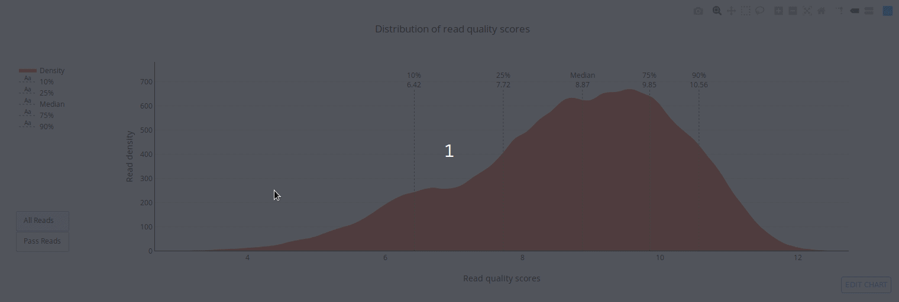
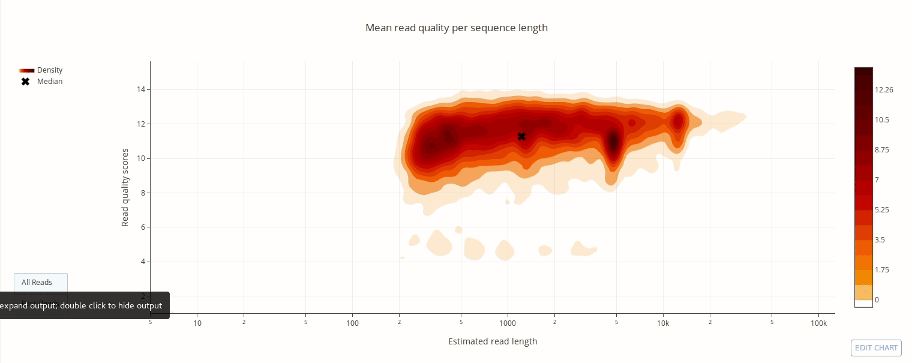
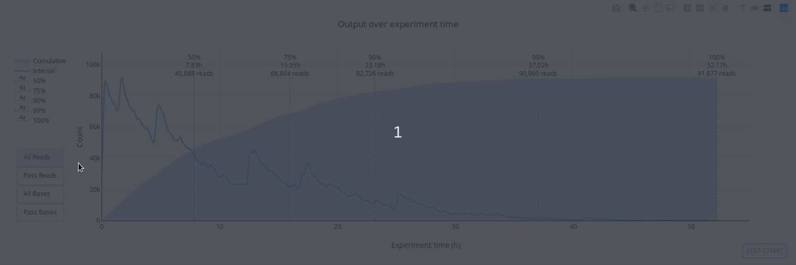

# pycoQC-2

[](http://joss.theoj.org/papers/ea8e08dc950622bdd5d16a65649954aa)
[](https://zenodo.org/badge/latestdoi/94531811)
[](https://gitter.im/pycoQC/community?utm_source=share-link&utm_medium=link&utm_campaign=share-link)

[](https://github.com/a-slide/pycoQC/blob/master/LICENSE)
[](https://www.python.org/)
[](https://badge.fury.io/py/pycoQC)
[](https://pepy.tech/project/pycoqc)

---

**PycoQC computes metrics and generates interactive QC plots for Oxford Nanopore technologies sequencing data**

PycoQC relies on the *sequencing_summary.txt* file generated by Albacore and Guppy, but if needed it can also generates a summary file from basecalled fast5 files. The package supports 1D and 1D2 runs generated with Minion, Gridion and Promethion devices and basecalled with Albacore 1.2.1+ or Guppy 2.1.3+. PycoQC is written in pure Python3. **Python 2 is not supported**.

# Gallery

**Click on a picture to access an online interactive version editable with [plotly chart studio](https://plot.ly/online-chart-maker/)**

[](https://plot.ly/~aleg/16/)

[](https://plot.ly/~aleg/2/distribution-of-read-length/)

[](https://plot.ly/~aleg/66/distribution-of-read-quality-scores/)

[](https://plot.ly/~aleg/3/mean-read-quality-per-sequence-length/)

[](https://plot.ly/~aleg/4/output-per-channel-over-experiment-time/)

[](https://plot.ly/~aleg/5/output-over-experiment-time/)

[](https://plot.ly/~aleg/6/mean-read-quality-over-experiment-time/)

[](https://plot.ly/~aleg/28/read-length-over-experiment-time/)

[](https://plot.ly/~aleg/7/percentage-of-reads-per-barcode/)


### Generating a sequencing summary file from Fast5 files

In case you do not have access to a summary sequencing file, pycoQC comes with a simple yet efficient tool to generate such file from a directory containing basecalled fast5 files. Please see the Demo notebook below for more information on how to generate to file through the python API. At the moment multi-fast5 files generated by Guppy are not supported.

### Generating a summary sequencing file

`Fast5_to_seq_summary -f {path to fast5 dir} -s {path to output summary sequecing file}`

`Fast5_to_seq_summary` help can be obtained by using `Fast5_to_seq_summary --help`.

```
usage: Fast5_to_seq_summary [-h] [--version] --fast5_dir FAST5_DIR
                            --seq_summary_fn SEQ_SUMMARY_FN
                            [--max_fast5 MAX_FAST5] [--threads THREADS]
                            [--basecall_id BASECALL_ID] [--fields FIELDS]
                            [--include_path] [--verbose_level VERBOSE_LEVEL]

Fast5_to_seq_summary generate a sequencing summary like file from a directory
containing Fast5 files

optional arguments:
  -h, --help            show this help message and exit
  --version, -v         show program's version number and exit
  --fast5_dir FAST5_DIR, -f FAST5_DIR
                        Directory containing fast5 files. Can contain multiple
                        subdirectories
  --seq_summary_fn SEQ_SUMMARY_FN, -s SEQ_SUMMARY_FN
                        path of the summary sequencing file where to write the
                        data extracted from the fast5 files
  --max_fast5 MAX_FAST5
                        Maximum number of file to try to parse. 0 to
                        deactivate (default: 0)
  --threads THREADS, -t THREADS
                        Total number of threads to use. 1 thread is used for
                        the reader and 1 for the writer. Minimum 3 (default:
                        4)
  --basecall_id BASECALL_ID
                        id of the basecalling group. By default leave to 0,
                        but if you perfome multiple basecalling on the same
                        fast5 files, this can be used to indicate the
                        corresponding group (1, 2 ...) (default: 0)
  --fields FIELDS       list of field names corresponding to attributes to try
                        to fetch from the fast5 files (default: read_id run_id
                        channel start_time sequence_length_template
                        mean_qscore_template
                        calibration_strand_genome_template
                        barcode_arrangement)
  --include_path        If given, the absolute path to the corresponding file
                        is added in an extra column (default: False)
  --verbose_level VERBOSE_LEVEL
                        Level of verbosity, from 2 (Chatty) to 0 (Nothing)
                        (default: 0)
```

## Authors

* Adrien Leger - aleg {at} ebi.ac.uk
* Tommaso Leonardi - tom {at} tleo.io
